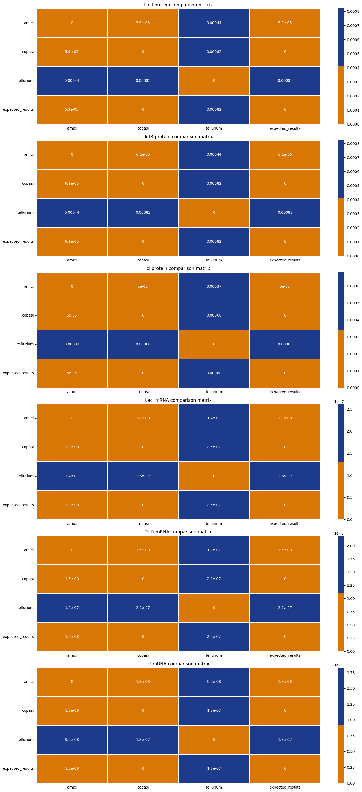

## **1. Install `bio-check`.**
### _This tooling can be accessed on PyPI as such:_


```python
# !pip install -q bio-check
```

## **2. Import the `Verifier`:**


```python
from pprint import pp

from bio_check import Verifier, __version__


f'Current version of bio-check: {__version__}'
```


    'Current version of bio-check: 1.4.0'


## **3. Instantiate the `Verifier`:**


```python
verifier = Verifier()
```

    {'bio-check-message': 'Hello from the Verification Service API!'}


## **4. Use the new instance to submit a new verification:**
### _There are 3 possible entry-points for verifications/comparisons:_
#### - OMEX/COMBINE archive. **We will use this for our example**.
#### - SBML File.
#### - Antimony Model (as a `str`)

#### **NOTE: _For each verification "job", users may also optionally submit an "expected results" file in HDF5 (`.h5`) format defining datasets of expected results to be included in the comparison calculation. Please refer to [the HDF5 documentation](https://docs.h5py.org/en/stable/) for more information on the use of HDF5 with Python._**

### **We can use the verifier's `.get_compatible()` method to find which simulators are compatible with our OMEX input file:**


```python
omex_filepath = '../model-examples/sbml-core/Elowitz-Nature-2000-Repressilator.omex'
report_filepath = '../model-examples/sbml-core/Elowitz-Nature-2000-Repressilator/reports.h5'
rel_tol = None
abs_tol = None

simulators = verifier.get_compatible(file=omex_filepath, versions=False)
simulators.sort()

simulators
```


    ['amici', 'copasi', 'tellurium']


### **The `Verifier` has two unique methods for submitting new verifications based on the individual requirements of OMEX/COMBINE and SBML verifications, respectively.**

#### _Relative(`rTol[float]`) & Absolute(`aTol[float`) tolerances for proximity comparisons as well as `comparison_id[str]`, `include_outputs[bool]`, and `_steady_state[bool]` may be included as keyword arguments in addition to that which is specified below:_


```python
submission = verifier.verify_omex(
    omex_filepath=omex_filepath,
    simulators=simulators,
    expected_results=report_filepath,
    rTol=rel_tol,
    aTol=abs_tol
)
```

    Selection list: None


```python
submission
```


    {'job_id': 'bio_check-request-ba8caf28-3350-4e17-905c-8b768b98b517_35987621-19c0-43c1-a83d-2d031d537240',
     'status': 'PENDING',
     'timestamp': '2024-08-12 13:54:13.175583',
     'comparison_id': None,
     'path': 'uploads/bio_check-request-ba8caf28-3350-4e17-905c-8b768b98b517_35987621-19c0-43c1-a83d-2d031d537240/Elowitz-Nature-2000-Repressilator.omex',
     'simulators': ['amici,copasi,tellurium'],
     'expected_results': 'uploads/bio_check-request-ba8caf28-3350-4e17-905c-8b768b98b517_35987621-19c0-43c1-a83d-2d031d537240/reports.h5',
     'include_output': True,
     'rTol': None,
     'aTol': None,
     'selection_list': None}


**PLEASE NOTE: passing/setting `_steady_state` to `True` in the call below will result in a `NotImplementedError` being raised as this feature is currently under development and for demonstration purposes only.**

## **5. Get submission job result data via the `Verifier`'s `.get_verify_output()` method using the above submission's `'job_id'`. Here is an already run job id:**


```python
submission_id = "repressilator_demo_85b85f4a-8279-455e-b6ab-c3c5fd27d488"
```


```python
verification_data = verifier.get_verify_output(submission_id)
```

#### Root mean-squared error is calculated for simulators over the entire space of observables based on their scores for each respective observable:


```python
verification_data['content']['results']['rmse']
```


    {'amici': 0.00017356297852656993,
     'copasi': 0.0003181491692907841,
     'tellurium': 0.0004800004922470449,
     'expected_results': 0.0003181491692907841}


#### Mean-squared error and Proximity scores are also available for each output observable. For example, `cI mRNA`:


```python
ci_mrna_data = verification_data['content']['results']['results']['cI mRNA']

pp(ci_mrna_data['proximity'])
```

    {'amici': {'amici': True,
               'copasi': True,
               'tellurium': True,
               'expected_results': True},
     'copasi': {'amici': True,
                'copasi': True,
                'tellurium': True,
                'expected_results': True},
     'tellurium': {'amici': True,
                   'copasi': True,
                   'tellurium': True,
                   'expected_results': True},
     'expected_results': {'amici': True,
                          'copasi': True,
                          'tellurium': True,
                          'expected_results': True}}


```python
pp(ci_mrna_data['mse'])
```

    {'amici': {'amici': 0.0,
               'copasi': 1.3046843397092567e-08,
               'tellurium': 9.945913020103205e-08,
               'expected_results': 1.3046843397092567e-08},
     'copasi': {'amici': 1.3046843397092567e-08,
                'copasi': 0.0,
                'tellurium': 1.8306527496148398e-07,
                'expected_results': 0.0},
     'tellurium': {'amici': 9.945913020103205e-08,
                   'copasi': 1.8306527496148398e-07,
                   'tellurium': 0.0,
                   'expected_results': 1.8306527496148398e-07},
     'expected_results': {'amici': 1.3046843397092567e-08,
                          'copasi': 0.0,
                          'tellurium': 1.8306527496148398e-07,
                          'expected_results': 0.0}}


## **5. Visualize simulation observables indexed by simulator**:

#### _Use the `"simulators"` -based hue for line-color. This will result in each column being of a different hue._


```python
# you can slice/display data by both time and simulator dimensions:
output_plots_simulator_hue = verifier.visualize_outputs(
    data=verification_data,
    simulators=['amici', 'copasi', 'tellurium'],
    output_start=400,
    output_end=1000,
    num_points=600,
    hue='simulators'
)
```


    

    


### Same visualization, but using the `"species"` hue.


```python
# color-coded by each row (observable name)
output_plots_species_hue = verifier.visualize_outputs(
    data=verification_data,
    simulators=['amici', 'copasi', 'tellurium'],
    output_start=400,
    output_end=1000,
    num_points=600,
    hue='species'
)
```


    

    


### 4b. Plot the comparison data in the form of a heatmap.


```python
comparison_plots = verifier.visualize_comparison(
    data=verification_data,
    simulators=['amici', 'copasi', 'tellurium', 'expected_results'],
    comparison_type='proximity'
)
```


    

    


```python
# plot comparison matrix for Mean Squared Error
comparison_plots_mse = verifier.visualize_comparison(
    data=verification_data,
    simulators=['amici', 'copasi', 'tellurium', 'expected_results'],
    comparison_type='mse'
)
```


    

    


### 5a. Save any generated plot with the verifier.


```python
verifier.export_plot(fig=comparison_plots, save_dest=f"/content/repressilator-comparison.pdf")
```

### 5b. Save an output plot grid


```python
verifier.export_plot(fig=output_plots_simulator_hue, save_dest=f"/content/repressilator-observables.pdf")
```

### 6a. Export data to CSV


```python
verifier.export_csv(data=verification_data, save_dest=f"/content/repressilator-observables.csv", simulators=simulators)
```

### 6b. Read in any exported CSV file as a pandas dataframe


```python
verifier.read_observables("/content/repressilator-observables.csv")
```


  <div id="df-c7cec6d9-c6b2-47d1-85c9-4703e98258aa" class="colab-df-container">
    <div>
<style scoped>
    .dataframe tbody tr th:only-of-type {
        vertical-align: middle;
    }

    .dataframe tbody tr th {
        vertical-align: top;
    }

    .dataframe thead th {
        text-align: right;
    }
</style>
<table border="1" class="dataframe">
  <thead>
    <tr style="text-align: right;">
      <th></th>
      <th>LacI protein_amici</th>
      <th>LacI protein_copasi</th>
      <th>LacI protein_tellurium</th>
      <th>TetR protein_amici</th>
      <th>TetR protein_copasi</th>
      <th>TetR protein_tellurium</th>
      <th>cI protein_amici</th>
      <th>cI protein_copasi</th>
      <th>cI protein_tellurium</th>
      <th>LacI mRNA_amici</th>
      <th>LacI mRNA_copasi</th>
      <th>LacI mRNA_tellurium</th>
      <th>TetR mRNA_amici</th>
      <th>TetR mRNA_copasi</th>
      <th>TetR mRNA_tellurium</th>
      <th>cI mRNA_amici</th>
      <th>cI mRNA_copasi</th>
      <th>cI mRNA_tellurium</th>
    </tr>
  </thead>
  <tbody>
    <tr>
      <th>0</th>
      <td>1971.268573</td>
      <td>1971.270446</td>
      <td>1971.265339</td>
      <td>51.895554</td>
      <td>51.895620</td>
      <td>51.895323</td>
      <td>1971.268573</td>
      <td>1971.270446</td>
      <td>1971.265339</td>
      <td>32.523911</td>
      <td>32.523889</td>
      <td>32.524067</td>
      <td>0.689213</td>
      <td>0.689216</td>
      <td>0.689204</td>
      <td>32.523911</td>
      <td>32.523889</td>
      <td>32.524067</td>
    </tr>
    <tr>
      <th>1</th>
      <td>2056.478843</td>
      <td>2056.480504</td>
      <td>2056.474962</td>
      <td>53.318600</td>
      <td>53.318683</td>
      <td>53.318418</td>
      <td>2056.478843</td>
      <td>2056.480504</td>
      <td>2056.474962</td>
      <td>32.302486</td>
      <td>32.302454</td>
      <td>32.302603</td>
      <td>0.774583</td>
      <td>0.774587</td>
      <td>0.774574</td>
      <td>32.302486</td>
      <td>32.302454</td>
      <td>32.302603</td>
    </tr>
    <tr>
      <th>2</th>
      <td>2133.475001</td>
      <td>2133.476360</td>
      <td>2133.472650</td>
      <td>55.257774</td>
      <td>55.257876</td>
      <td>55.257563</td>
      <td>2133.475001</td>
      <td>2133.476360</td>
      <td>2133.472650</td>
      <td>31.777324</td>
      <td>31.777281</td>
      <td>31.777481</td>
      <td>0.871931</td>
      <td>0.871935</td>
      <td>0.871921</td>
      <td>31.777324</td>
      <td>31.777281</td>
      <td>31.777481</td>
    </tr>
    <tr>
      <th>3</th>
      <td>2200.760995</td>
      <td>2200.761993</td>
      <td>2200.761147</td>
      <td>57.764048</td>
      <td>57.764172</td>
      <td>57.763840</td>
      <td>2200.760995</td>
      <td>2200.761993</td>
      <td>2200.761147</td>
      <td>30.946462</td>
      <td>30.946407</td>
      <td>30.946693</td>
      <td>0.982860</td>
      <td>0.982864</td>
      <td>0.982849</td>
      <td>30.946462</td>
      <td>30.946407</td>
      <td>30.946693</td>
    </tr>
    <tr>
      <th>4</th>
      <td>2256.962433</td>
      <td>2256.962984</td>
      <td>2256.965006</td>
      <td>60.896368</td>
      <td>60.896516</td>
      <td>60.896120</td>
      <td>2256.962433</td>
      <td>2256.962984</td>
      <td>2256.965006</td>
      <td>29.818385</td>
      <td>29.818316</td>
      <td>29.818618</td>
      <td>1.109167</td>
      <td>1.109172</td>
      <td>1.109154</td>
      <td>29.818385</td>
      <td>29.818316</td>
      <td>29.818618</td>
    </tr>
    <tr>
      <th>...</th>
      <td>...</td>
      <td>...</td>
      <td>...</td>
      <td>...</td>
      <td>...</td>
      <td>...</td>
      <td>...</td>
      <td>...</td>
      <td>...</td>
      <td>...</td>
      <td>...</td>
      <td>...</td>
      <td>...</td>
      <td>...</td>
      <td>...</td>
      <td>...</td>
      <td>...</td>
      <td>...</td>
    </tr>
    <tr>
      <th>596</th>
      <td>109.137255</td>
      <td>109.139883</td>
      <td>109.129681</td>
      <td>193.464301</td>
      <td>193.461304</td>
      <td>193.472947</td>
      <td>109.137255</td>
      <td>109.139883</td>
      <td>109.129681</td>
      <td>2.679883</td>
      <td>2.679961</td>
      <td>2.679657</td>
      <td>0.112850</td>
      <td>0.112850</td>
      <td>0.112851</td>
      <td>2.679883</td>
      <td>2.679961</td>
      <td>2.679657</td>
    </tr>
    <tr>
      <th>597</th>
      <td>120.938334</td>
      <td>120.941340</td>
      <td>120.929654</td>
      <td>181.264906</td>
      <td>181.262111</td>
      <td>181.272977</td>
      <td>120.938334</td>
      <td>120.941340</td>
      <td>120.929654</td>
      <td>3.030193</td>
      <td>3.030281</td>
      <td>3.029939</td>
      <td>0.113085</td>
      <td>0.113085</td>
      <td>0.113086</td>
      <td>3.030193</td>
      <td>3.030281</td>
      <td>3.029939</td>
    </tr>
    <tr>
      <th>598</th>
      <td>134.440854</td>
      <td>134.444280</td>
      <td>134.430938</td>
      <td>169.885196</td>
      <td>169.882590</td>
      <td>169.892728</td>
      <td>134.440854</td>
      <td>134.444280</td>
      <td>134.430938</td>
      <td>3.424273</td>
      <td>3.424372</td>
      <td>3.423987</td>
      <td>0.113661</td>
      <td>0.113662</td>
      <td>0.113661</td>
      <td>3.424273</td>
      <td>3.424372</td>
      <td>3.423987</td>
    </tr>
    <tr>
      <th>599</th>
      <td>149.839122</td>
      <td>149.843019</td>
      <td>149.827826</td>
      <td>159.272577</td>
      <td>159.270147</td>
      <td>159.279604</td>
      <td>149.839122</td>
      <td>149.843019</td>
      <td>149.827826</td>
      <td>3.866630</td>
      <td>3.866741</td>
      <td>3.866308</td>
      <td>0.114584</td>
      <td>0.114584</td>
      <td>0.114584</td>
      <td>3.866630</td>
      <td>3.866741</td>
      <td>3.866308</td>
    </tr>
    <tr>
      <th>600</th>
      <td>167.345347</td>
      <td>167.349768</td>
      <td>167.332514</td>
      <td>149.378045</td>
      <td>149.375781</td>
      <td>149.384598</td>
      <td>167.345347</td>
      <td>167.349768</td>
      <td>167.332514</td>
      <td>4.361978</td>
      <td>4.362102</td>
      <td>4.361618</td>
      <td>0.115868</td>
      <td>0.115868</td>
      <td>0.115867</td>
      <td>4.361978</td>
      <td>4.362102</td>
      <td>4.361618</td>
    </tr>
  </tbody>
</table>
<p>601 rows × 18 columns</p>
</div>
    <div class="colab-df-buttons">

  <div class="colab-df-container">
    <button class="colab-df-convert" onclick="convertToInteractive('df-c7cec6d9-c6b2-47d1-85c9-4703e98258aa')"
            title="Convert this dataframe to an interactive table."
            style="display:none;">

  <svg xmlns="http://www.w3.org/2000/svg" height="24px" viewBox="0 -960 960 960">
    <path d="M120-120v-720h720v720H120Zm60-500h600v-160H180v160Zm220 220h160v-160H400v160Zm0 220h160v-160H400v160ZM180-400h160v-160H180v160Zm440 0h160v-160H620v160ZM180-180h160v-160H180v160Zm440 0h160v-160H620v160Z"/>
  </svg>
    </button>

  <style>
    .colab-df-container {
      display:flex;
      gap: 12px;
    }

    .colab-df-convert {
      background-color: #E8F0FE;
      border: none;
      border-radius: 50%;
      cursor: pointer;
      display: none;
      fill: #1967D2;
      height: 32px;
      padding: 0 0 0 0;
      width: 32px;
    }

    .colab-df-convert:hover {
      background-color: #E2EBFA;
      box-shadow: 0px 1px 2px rgba(60, 64, 67, 0.3), 0px 1px 3px 1px rgba(60, 64, 67, 0.15);
      fill: #174EA6;
    }

    .colab-df-buttons div {
      margin-bottom: 4px;
    }

    [theme=dark] .colab-df-convert {
      background-color: #3B4455;
      fill: #D2E3FC;
    }

    [theme=dark] .colab-df-convert:hover {
      background-color: #434B5C;
      box-shadow: 0px 1px 3px 1px rgba(0, 0, 0, 0.15);
      filter: drop-shadow(0px 1px 2px rgba(0, 0, 0, 0.3));
      fill: #FFFFFF;
    }
  </style>

    <script>
      const buttonEl =
        document.querySelector('#df-c7cec6d9-c6b2-47d1-85c9-4703e98258aa button.colab-df-convert');
      buttonEl.style.display =
        google.colab.kernel.accessAllowed ? 'block' : 'none';

      async function convertToInteractive(key) {
        const element = document.querySelector('#df-c7cec6d9-c6b2-47d1-85c9-4703e98258aa');
        const dataTable =
          await google.colab.kernel.invokeFunction('convertToInteractive',
                                                    [key], {});
        if (!dataTable) return;

        const docLinkHtml = 'Like what you see? Visit the ' +
          '<a target="_blank" href=https://colab.research.google.com/notebooks/data_table.ipynb>data table notebook</a>'
          + ' to learn more about interactive tables.';
        element.innerHTML = '';
        dataTable['output_type'] = 'display_data';
        await google.colab.output.renderOutput(dataTable, element);
        const docLink = document.createElement('div');
        docLink.innerHTML = docLinkHtml;
        element.appendChild(docLink);
      }
    </script>
  </div>


<div id="df-14aee9c2-23c4-4a3d-87b9-494a2bc4323e">
  <button class="colab-df-quickchart" onclick="quickchart('df-14aee9c2-23c4-4a3d-87b9-494a2bc4323e')"
            title="Suggest charts"
            style="display:none;">

<svg xmlns="http://www.w3.org/2000/svg" height="24px"viewBox="0 0 24 24"
     width="24px">
    <g>
        <path d="M19 3H5c-1.1 0-2 .9-2 2v14c0 1.1.9 2 2 2h14c1.1 0 2-.9 2-2V5c0-1.1-.9-2-2-2zM9 17H7v-7h2v7zm4 0h-2V7h2v10zm4 0h-2v-4h2v4z"/>
    </g>
</svg>
  </button>

<style>
  .colab-df-quickchart {
      --bg-color: #E8F0FE;
      --fill-color: #1967D2;
      --hover-bg-color: #E2EBFA;
      --hover-fill-color: #174EA6;
      --disabled-fill-color: #AAA;
      --disabled-bg-color: #DDD;
  }

  [theme=dark] .colab-df-quickchart {
      --bg-color: #3B4455;
      --fill-color: #D2E3FC;
      --hover-bg-color: #434B5C;
      --hover-fill-color: #FFFFFF;
      --disabled-bg-color: #3B4455;
      --disabled-fill-color: #666;
  }

  .colab-df-quickchart {
    background-color: var(--bg-color);
    border: none;
    border-radius: 50%;
    cursor: pointer;
    display: none;
    fill: var(--fill-color);
    height: 32px;
    padding: 0;
    width: 32px;
  }

  .colab-df-quickchart:hover {
    background-color: var(--hover-bg-color);
    box-shadow: 0 1px 2px rgba(60, 64, 67, 0.3), 0 1px 3px 1px rgba(60, 64, 67, 0.15);
    fill: var(--button-hover-fill-color);
  }

  .colab-df-quickchart-complete:disabled,
  .colab-df-quickchart-complete:disabled:hover {
    background-color: var(--disabled-bg-color);
    fill: var(--disabled-fill-color);
    box-shadow: none;
  }

  .colab-df-spinner {
    border: 2px solid var(--fill-color);
    border-color: transparent;
    border-bottom-color: var(--fill-color);
    animation:
      spin 1s steps(1) infinite;
  }

  @keyframes spin {
    0% {
      border-color: transparent;
      border-bottom-color: var(--fill-color);
      border-left-color: var(--fill-color);
    }
    20% {
      border-color: transparent;
      border-left-color: var(--fill-color);
      border-top-color: var(--fill-color);
    }
    30% {
      border-color: transparent;
      border-left-color: var(--fill-color);
      border-top-color: var(--fill-color);
      border-right-color: var(--fill-color);
    }
    40% {
      border-color: transparent;
      border-right-color: var(--fill-color);
      border-top-color: var(--fill-color);
    }
    60% {
      border-color: transparent;
      border-right-color: var(--fill-color);
    }
    80% {
      border-color: transparent;
      border-right-color: var(--fill-color);
      border-bottom-color: var(--fill-color);
    }
    90% {
      border-color: transparent;
      border-bottom-color: var(--fill-color);
    }
  }
</style>

  <script>
    async function quickchart(key) {
      const quickchartButtonEl =
        document.querySelector('#' + key + ' button');
      quickchartButtonEl.disabled = true;  // To prevent multiple clicks.
      quickchartButtonEl.classList.add('colab-df-spinner');
      try {
        const charts = await google.colab.kernel.invokeFunction(
            'suggestCharts', [key], {});
      } catch (error) {
        console.error('Error during call to suggestCharts:', error);
      }
      quickchartButtonEl.classList.remove('colab-df-spinner');
      quickchartButtonEl.classList.add('colab-df-quickchart-complete');
    }
    (() => {
      let quickchartButtonEl =
        document.querySelector('#df-14aee9c2-23c4-4a3d-87b9-494a2bc4323e button');
      quickchartButtonEl.style.display =
        google.colab.kernel.accessAllowed ? 'block' : 'none';
    })();
  </script>
</div>

    </div>
  </div>


### 7. Create a dataframe from the time series data generated from the above `verifier.get_verifiy_output()` calls


```python
verifier.get_observables(data=verification_data, simulators=simulators)
```


  <div id="df-2985f55a-ddfd-4cc6-b730-cec8a6b070e9" class="colab-df-container">
    <div>
<style scoped>
    .dataframe tbody tr th:only-of-type {
        vertical-align: middle;
    }

    .dataframe tbody tr th {
        vertical-align: top;
    }

    .dataframe thead th {
        text-align: right;
    }
</style>
<table border="1" class="dataframe">
  <thead>
    <tr style="text-align: right;">
      <th></th>
      <th>LacI protein_amici</th>
      <th>LacI protein_copasi</th>
      <th>LacI protein_tellurium</th>
      <th>TetR protein_amici</th>
      <th>TetR protein_copasi</th>
      <th>TetR protein_tellurium</th>
      <th>cI protein_amici</th>
      <th>cI protein_copasi</th>
      <th>cI protein_tellurium</th>
      <th>LacI mRNA_amici</th>
      <th>LacI mRNA_copasi</th>
      <th>LacI mRNA_tellurium</th>
      <th>TetR mRNA_amici</th>
      <th>TetR mRNA_copasi</th>
      <th>TetR mRNA_tellurium</th>
      <th>cI mRNA_amici</th>
      <th>cI mRNA_copasi</th>
      <th>cI mRNA_tellurium</th>
    </tr>
  </thead>
  <tbody>
    <tr>
      <th>0</th>
      <td>1971.268573</td>
      <td>1971.270446</td>
      <td>1971.265339</td>
      <td>51.895554</td>
      <td>51.895620</td>
      <td>51.895323</td>
      <td>1971.268573</td>
      <td>1971.270446</td>
      <td>1971.265339</td>
      <td>32.523911</td>
      <td>32.523889</td>
      <td>32.524067</td>
      <td>0.689213</td>
      <td>0.689216</td>
      <td>0.689204</td>
      <td>32.523911</td>
      <td>32.523889</td>
      <td>32.524067</td>
    </tr>
    <tr>
      <th>1</th>
      <td>2056.478843</td>
      <td>2056.480504</td>
      <td>2056.474962</td>
      <td>53.318600</td>
      <td>53.318683</td>
      <td>53.318418</td>
      <td>2056.478843</td>
      <td>2056.480504</td>
      <td>2056.474962</td>
      <td>32.302486</td>
      <td>32.302454</td>
      <td>32.302603</td>
      <td>0.774583</td>
      <td>0.774587</td>
      <td>0.774574</td>
      <td>32.302486</td>
      <td>32.302454</td>
      <td>32.302603</td>
    </tr>
    <tr>
      <th>2</th>
      <td>2133.475001</td>
      <td>2133.476360</td>
      <td>2133.472650</td>
      <td>55.257774</td>
      <td>55.257876</td>
      <td>55.257563</td>
      <td>2133.475001</td>
      <td>2133.476360</td>
      <td>2133.472650</td>
      <td>31.777324</td>
      <td>31.777281</td>
      <td>31.777481</td>
      <td>0.871931</td>
      <td>0.871935</td>
      <td>0.871921</td>
      <td>31.777324</td>
      <td>31.777281</td>
      <td>31.777481</td>
    </tr>
    <tr>
      <th>3</th>
      <td>2200.760995</td>
      <td>2200.761993</td>
      <td>2200.761147</td>
      <td>57.764048</td>
      <td>57.764172</td>
      <td>57.763840</td>
      <td>2200.760995</td>
      <td>2200.761993</td>
      <td>2200.761147</td>
      <td>30.946462</td>
      <td>30.946407</td>
      <td>30.946693</td>
      <td>0.982860</td>
      <td>0.982864</td>
      <td>0.982849</td>
      <td>30.946462</td>
      <td>30.946407</td>
      <td>30.946693</td>
    </tr>
    <tr>
      <th>4</th>
      <td>2256.962433</td>
      <td>2256.962984</td>
      <td>2256.965006</td>
      <td>60.896368</td>
      <td>60.896516</td>
      <td>60.896120</td>
      <td>2256.962433</td>
      <td>2256.962984</td>
      <td>2256.965006</td>
      <td>29.818385</td>
      <td>29.818316</td>
      <td>29.818618</td>
      <td>1.109167</td>
      <td>1.109172</td>
      <td>1.109154</td>
      <td>29.818385</td>
      <td>29.818316</td>
      <td>29.818618</td>
    </tr>
    <tr>
      <th>...</th>
      <td>...</td>
      <td>...</td>
      <td>...</td>
      <td>...</td>
      <td>...</td>
      <td>...</td>
      <td>...</td>
      <td>...</td>
      <td>...</td>
      <td>...</td>
      <td>...</td>
      <td>...</td>
      <td>...</td>
      <td>...</td>
      <td>...</td>
      <td>...</td>
      <td>...</td>
      <td>...</td>
    </tr>
    <tr>
      <th>596</th>
      <td>109.137255</td>
      <td>109.139883</td>
      <td>109.129681</td>
      <td>193.464301</td>
      <td>193.461304</td>
      <td>193.472947</td>
      <td>109.137255</td>
      <td>109.139883</td>
      <td>109.129681</td>
      <td>2.679883</td>
      <td>2.679961</td>
      <td>2.679657</td>
      <td>0.112850</td>
      <td>0.112850</td>
      <td>0.112851</td>
      <td>2.679883</td>
      <td>2.679961</td>
      <td>2.679657</td>
    </tr>
    <tr>
      <th>597</th>
      <td>120.938334</td>
      <td>120.941340</td>
      <td>120.929654</td>
      <td>181.264906</td>
      <td>181.262111</td>
      <td>181.272977</td>
      <td>120.938334</td>
      <td>120.941340</td>
      <td>120.929654</td>
      <td>3.030193</td>
      <td>3.030281</td>
      <td>3.029939</td>
      <td>0.113085</td>
      <td>0.113085</td>
      <td>0.113086</td>
      <td>3.030193</td>
      <td>3.030281</td>
      <td>3.029939</td>
    </tr>
    <tr>
      <th>598</th>
      <td>134.440854</td>
      <td>134.444280</td>
      <td>134.430938</td>
      <td>169.885196</td>
      <td>169.882590</td>
      <td>169.892728</td>
      <td>134.440854</td>
      <td>134.444280</td>
      <td>134.430938</td>
      <td>3.424273</td>
      <td>3.424372</td>
      <td>3.423987</td>
      <td>0.113661</td>
      <td>0.113662</td>
      <td>0.113661</td>
      <td>3.424273</td>
      <td>3.424372</td>
      <td>3.423987</td>
    </tr>
    <tr>
      <th>599</th>
      <td>149.839122</td>
      <td>149.843019</td>
      <td>149.827826</td>
      <td>159.272577</td>
      <td>159.270147</td>
      <td>159.279604</td>
      <td>149.839122</td>
      <td>149.843019</td>
      <td>149.827826</td>
      <td>3.866630</td>
      <td>3.866741</td>
      <td>3.866308</td>
      <td>0.114584</td>
      <td>0.114584</td>
      <td>0.114584</td>
      <td>3.866630</td>
      <td>3.866741</td>
      <td>3.866308</td>
    </tr>
    <tr>
      <th>600</th>
      <td>167.345347</td>
      <td>167.349768</td>
      <td>167.332514</td>
      <td>149.378045</td>
      <td>149.375781</td>
      <td>149.384598</td>
      <td>167.345347</td>
      <td>167.349768</td>
      <td>167.332514</td>
      <td>4.361978</td>
      <td>4.362102</td>
      <td>4.361618</td>
      <td>0.115868</td>
      <td>0.115868</td>
      <td>0.115867</td>
      <td>4.361978</td>
      <td>4.362102</td>
      <td>4.361618</td>
    </tr>
  </tbody>
</table>
<p>601 rows × 18 columns</p>
</div>
    <div class="colab-df-buttons">

  <div class="colab-df-container">
    <button class="colab-df-convert" onclick="convertToInteractive('df-2985f55a-ddfd-4cc6-b730-cec8a6b070e9')"
            title="Convert this dataframe to an interactive table."
            style="display:none;">

  <svg xmlns="http://www.w3.org/2000/svg" height="24px" viewBox="0 -960 960 960">
    <path d="M120-120v-720h720v720H120Zm60-500h600v-160H180v160Zm220 220h160v-160H400v160Zm0 220h160v-160H400v160ZM180-400h160v-160H180v160Zm440 0h160v-160H620v160ZM180-180h160v-160H180v160Zm440 0h160v-160H620v160Z"/>
  </svg>
    </button>

  <style>
    .colab-df-container {
      display:flex;
      gap: 12px;
    }

    .colab-df-convert {
      background-color: #E8F0FE;
      border: none;
      border-radius: 50%;
      cursor: pointer;
      display: none;
      fill: #1967D2;
      height: 32px;
      padding: 0 0 0 0;
      width: 32px;
    }

    .colab-df-convert:hover {
      background-color: #E2EBFA;
      box-shadow: 0px 1px 2px rgba(60, 64, 67, 0.3), 0px 1px 3px 1px rgba(60, 64, 67, 0.15);
      fill: #174EA6;
    }

    .colab-df-buttons div {
      margin-bottom: 4px;
    }

    [theme=dark] .colab-df-convert {
      background-color: #3B4455;
      fill: #D2E3FC;
    }

    [theme=dark] .colab-df-convert:hover {
      background-color: #434B5C;
      box-shadow: 0px 1px 3px 1px rgba(0, 0, 0, 0.15);
      filter: drop-shadow(0px 1px 2px rgba(0, 0, 0, 0.3));
      fill: #FFFFFF;
    }
  </style>

    <script>
      const buttonEl =
        document.querySelector('#df-2985f55a-ddfd-4cc6-b730-cec8a6b070e9 button.colab-df-convert');
      buttonEl.style.display =
        google.colab.kernel.accessAllowed ? 'block' : 'none';

      async function convertToInteractive(key) {
        const element = document.querySelector('#df-2985f55a-ddfd-4cc6-b730-cec8a6b070e9');
        const dataTable =
          await google.colab.kernel.invokeFunction('convertToInteractive',
                                                    [key], {});
        if (!dataTable) return;

        const docLinkHtml = 'Like what you see? Visit the ' +
          '<a target="_blank" href=https://colab.research.google.com/notebooks/data_table.ipynb>data table notebook</a>'
          + ' to learn more about interactive tables.';
        element.innerHTML = '';
        dataTable['output_type'] = 'display_data';
        await google.colab.output.renderOutput(dataTable, element);
        const docLink = document.createElement('div');
        docLink.innerHTML = docLinkHtml;
        element.appendChild(docLink);
      }
    </script>
  </div>


<div id="df-ca714d75-63e8-4975-9427-e36839aef610">
  <button class="colab-df-quickchart" onclick="quickchart('df-ca714d75-63e8-4975-9427-e36839aef610')"
            title="Suggest charts"
            style="display:none;">

<svg xmlns="http://www.w3.org/2000/svg" height="24px"viewBox="0 0 24 24"
     width="24px">
    <g>
        <path d="M19 3H5c-1.1 0-2 .9-2 2v14c0 1.1.9 2 2 2h14c1.1 0 2-.9 2-2V5c0-1.1-.9-2-2-2zM9 17H7v-7h2v7zm4 0h-2V7h2v10zm4 0h-2v-4h2v4z"/>
    </g>
</svg>
  </button>

<style>
  .colab-df-quickchart {
      --bg-color: #E8F0FE;
      --fill-color: #1967D2;
      --hover-bg-color: #E2EBFA;
      --hover-fill-color: #174EA6;
      --disabled-fill-color: #AAA;
      --disabled-bg-color: #DDD;
  }

  [theme=dark] .colab-df-quickchart {
      --bg-color: #3B4455;
      --fill-color: #D2E3FC;
      --hover-bg-color: #434B5C;
      --hover-fill-color: #FFFFFF;
      --disabled-bg-color: #3B4455;
      --disabled-fill-color: #666;
  }

  .colab-df-quickchart {
    background-color: var(--bg-color);
    border: none;
    border-radius: 50%;
    cursor: pointer;
    display: none;
    fill: var(--fill-color);
    height: 32px;
    padding: 0;
    width: 32px;
  }

  .colab-df-quickchart:hover {
    background-color: var(--hover-bg-color);
    box-shadow: 0 1px 2px rgba(60, 64, 67, 0.3), 0 1px 3px 1px rgba(60, 64, 67, 0.15);
    fill: var(--button-hover-fill-color);
  }

  .colab-df-quickchart-complete:disabled,
  .colab-df-quickchart-complete:disabled:hover {
    background-color: var(--disabled-bg-color);
    fill: var(--disabled-fill-color);
    box-shadow: none;
  }

  .colab-df-spinner {
    border: 2px solid var(--fill-color);
    border-color: transparent;
    border-bottom-color: var(--fill-color);
    animation:
      spin 1s steps(1) infinite;
  }

  @keyframes spin {
    0% {
      border-color: transparent;
      border-bottom-color: var(--fill-color);
      border-left-color: var(--fill-color);
    }
    20% {
      border-color: transparent;
      border-left-color: var(--fill-color);
      border-top-color: var(--fill-color);
    }
    30% {
      border-color: transparent;
      border-left-color: var(--fill-color);
      border-top-color: var(--fill-color);
      border-right-color: var(--fill-color);
    }
    40% {
      border-color: transparent;
      border-right-color: var(--fill-color);
      border-top-color: var(--fill-color);
    }
    60% {
      border-color: transparent;
      border-right-color: var(--fill-color);
    }
    80% {
      border-color: transparent;
      border-right-color: var(--fill-color);
      border-bottom-color: var(--fill-color);
    }
    90% {
      border-color: transparent;
      border-bottom-color: var(--fill-color);
    }
  }
</style>

  <script>
    async function quickchart(key) {
      const quickchartButtonEl =
        document.querySelector('#' + key + ' button');
      quickchartButtonEl.disabled = true;  // To prevent multiple clicks.
      quickchartButtonEl.classList.add('colab-df-spinner');
      try {
        const charts = await google.colab.kernel.invokeFunction(
            'suggestCharts', [key], {});
      } catch (error) {
        console.error('Error during call to suggestCharts:', error);
      }
      quickchartButtonEl.classList.remove('colab-df-spinner');
      quickchartButtonEl.classList.add('colab-df-quickchart-complete');
    }
    (() => {
      let quickchartButtonEl =
        document.querySelector('#df-ca714d75-63e8-4975-9427-e36839aef610 button');
      quickchartButtonEl.style.display =
        google.colab.kernel.accessAllowed ? 'block' : 'none';
    })();
  </script>
</div>

    </div>
  </div>


```python

```
